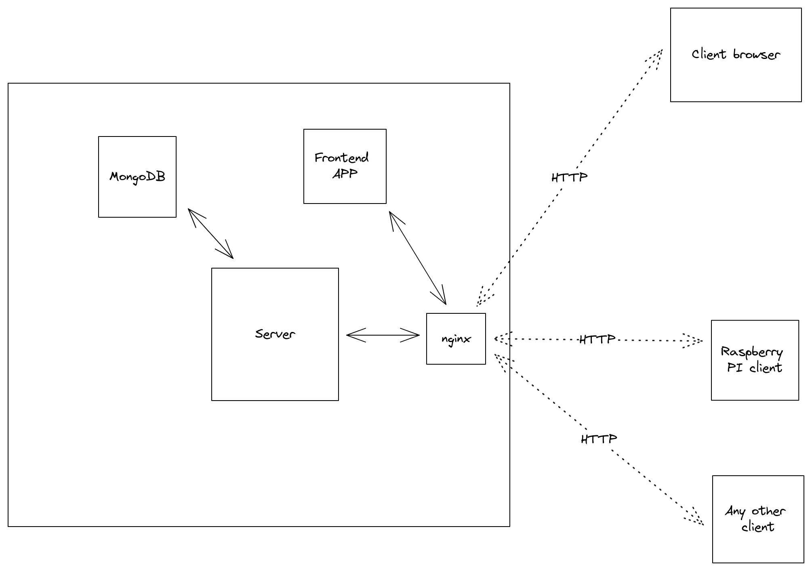

# my-pi-home

My-pi-home is a lightweight and straightforward application designed for recording, storing, and displaying temperature readings sent by external devices. The application also includes the capability to control relays, although this feature is not currently in use or supported by me.

## Motivation 

I developed this application to assist a family member in monitoring the furnace and indoor temperatures. Later on, I found it useful for my own use with devices such as Raspberry Pi (utilizing ds18b20 sensors) and NodeMCU (paired with ds18b20 sensors).

### Raspberry PI
There's a client tailored for Raspberry Pi (`/pi`) in place, which reads temperatures from ds18b20 sensors and transmits them to a specified address configured in the settings.

